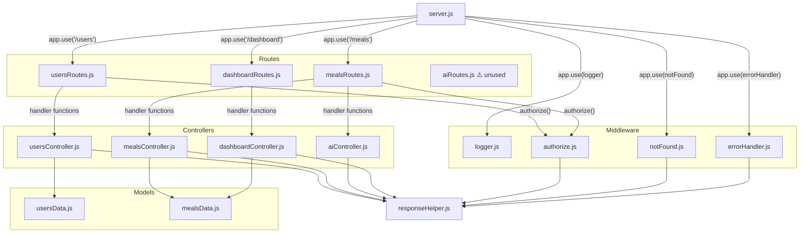
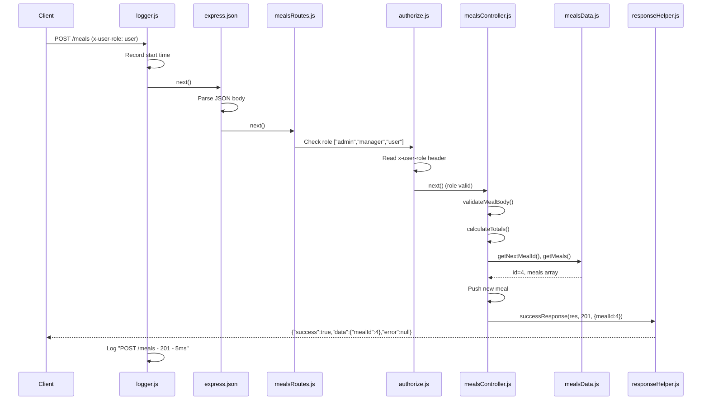

# Nutrition Tracker Backend — Project Walkthrough

## Project Tree

```
Nutrition_tracker_app/
├── server.js                  ← Entry point
├── package.json               ← NPM config & dependencies
├── .gitignore                 ← Git ignore rules
├── routes/
│   ├── usersRoutes.js         ← User endpoint routing
│   ├── mealsRoutes.js         ← Meal + AI endpoint routing
│   ├── aiRoutes.js            ← ⚠️ Unused / dead file
│   └── dashboardRoutes.js     ← Dashboard endpoint routing
├── controllers/
│   ├── usersController.js     ← User CRUD logic
│   ├── mealsController.js     ← Meal CRUD logic
│   ├── aiController.js        ← Mock AI analysis logic
│   └── dashboardController.js ← Daily summary logic
├── models/
│   ├── usersData.js           ← In-memory user data store
│   └── mealsData.js           ← In-memory meal data store
├── middleware/
│   ├── logger.js              ← Request logging (global)
│   ├── authorize.js           ← Role-based access control
│   ├── notFound.js            ← 404 catch-all handler
│   └── errorHandler.js        ← Global error handler
├── utils/
│   └── responseHelper.js      ← Standardized JSON response builders
└── docs/
    ├── README.md              ← Project documentation
    └── nutrition_tracker_postman_collection.json
```

---

## Dependency Diagram



---

## File-by-File Breakdown

---

### `server.js` — Application Entry Point

**Location**: Project root  
**Role**: Creates the Express app, wires all middleware and routes, starts the HTTP server.

**What it does, line by line:**
1. Imports Express, all three route modules, and three middleware modules.
2. Creates the `app` instance and sets port to `3000`.
3. Mounts middleware in this order:
   - `logger` — runs on **every** request (global)
   - `express.json()` — parses JSON request bodies
4. Defines a `GET /` home route that returns API info.
5. Mounts route groups:
   - `/users` → `usersRoutes`
   - `/meals` → `mealsRoutes`
   - `/dashboard` → `dashboardRoutes`
6. Mounts `notFound` (catches any unmatched route → 404).
7. Mounts `errorHandler` (catches thrown errors → 400 or 500).
8. Calls `app.listen(3000)`.

**Depends on**: All route files, `logger.js`, `notFound.js`, `errorHandler.js`  
**Depended on by**: Nothing — this is the root

> [!NOTE]
> `routes/aiRoutes.js` is **never imported** here. The analyze-image route is handled inside `mealsRoutes.js` instead.

---

### `package.json` — NPM Configuration

**Location**: Project root  
**Role**: Defines project metadata, scripts, and dependencies.

| Field | Value |
|-------|-------|
| `name` | `nutrition-backend` |
| `main` | `server.js` |
| `scripts.start` | `node server.js` |
| `scripts.dev` | `node server.js` |
| `dependencies` | `express: ^5.1.0` (only dependency) |
| `author` | Denis Kulman and Yael Dorahly |

---

### `.gitignore`

**Location**: Project root  
**Contents**: Ignores `node_modules/`, `.env`, `.DS_Store`

---

## Routes Layer

Each route file creates an `express.Router()`, maps HTTP methods + paths to controller functions, and optionally applies `authorize()` middleware on protected routes.

---

### `routes/usersRoutes.js`

**Location**: `routes/`  
**Role**: Maps all `/users` endpoints to `usersController` functions.

| Method | Path | Auth | Handler |
|--------|------|------|---------|
| GET | `/` | None | `getAllUsers` |
| GET | `/:id` | None | `getUserById` |
| POST | `/` | admin, manager | `createUser` |
| PUT | `/:id` | admin, manager | `updateUser` |
| DELETE | `/:id` | admin only | `deleteUser` |

**Depends on**: `usersController.js`, `authorize.js`  
**Depended on by**: `server.js`

---

### `routes/mealsRoutes.js`

**Location**: `routes/`  
**Role**: Maps all `/meals` endpoints, including the AI analyze-image route.

| Method | Path | Auth | Handler |
|--------|------|------|---------|
| GET | `/` | None | `getAllMeals` |
| POST | `/analyze-image` | admin, manager, user | `analyzeMealImage` |
| GET | `/:id` | None | `getMealById` |
| POST | `/` | admin, manager, user | `createMeal` |
| PUT | `/:id` | admin, manager, user | `updateMeal` |
| DELETE | `/:id` | admin only | `deleteMeal` |

**Depends on**: `mealsController.js`, `aiController.js`, `authorize.js`  
**Depended on by**: `server.js`

> [!IMPORTANT]
> `/analyze-image` is registered **before** `/:id` — this prevents Express from treating `"analyze-image"` as an id parameter.

---

### `routes/dashboardRoutes.js`

**Location**: `routes/`  
**Role**: Maps the `/dashboard/today` endpoint.

| Method | Path | Auth | Handler |
|--------|------|------|---------|
| GET | `/today` | None | `getTodayDashboard` |

**Depends on**: `dashboardController.js`  
**Depended on by**: `server.js`

---

### `routes/aiRoutes.js` ⚠️ Dead File

**Location**: `routes/`  
**Role**: Defines `POST /analyze-meal` — but this file is **never imported or mounted** in `server.js`.

The actual AI analysis route is handled in `mealsRoutes.js` line 9, which calls `aiController.analyzeMealImage` directly. This file has no effect on the running application.

---

## Controllers Layer

Controllers contain the business logic for each endpoint. They read/write data via model functions and send responses via `responseHelper`.

---

### `controllers/usersController.js`

**Location**: `controllers/`  
**Role**: Implements all user CRUD operations.  
**Exports**: `getAllUsers`, `getUserById`, `createUser`, `updateUser`, `deleteUser`

**Key behaviors:**
- **ID validation**: `isValidNumericId()` checks that `:id` is a positive integer; returns 400 if not.
- **getAllUsers**: Returns the full users array (200).
- **getUserById**: Finds by `userId`; returns 404 if not found.
- **createUser**: Validates `firstName`, `lastName`, `userRole` are present. Auto-generates `userId`, `createDate`, `updateDate`. Returns 201 with `{ userId }`.
- **updateUser**: Validates id + all three body fields. Spreads existing user and overwrites fields, updates `updateDate`. Returns 200.
- **deleteUser**: Validates id, checks existence, filters the user out of the array via `setUsers()`. Returns 200.

**Depends on**: `usersData.js` (getUsers, setUsers, getNextUserId), `responseHelper.js`  
**Depended on by**: `usersRoutes.js`

---

### `controllers/mealsController.js`

**Location**: `controllers/`  
**Role**: Implements all meal CRUD operations. The largest controller (278 lines).  
**Exports**: `getAllMeals`, `getMealById`, `createMeal`, `updateMeal`, `deleteMeal`

**Key internal helpers:**
- `isValidNumericId(id)` — same validation pattern as users.
- `calculateTotals(items)` — sums `calories`, `protein`, `carbs`, `fat` across all food items. Returns totals rounded to 1 decimal.
- `validateMealBody(body)` — validates `userId`, `mealName`, `mealDate`, `items` (must be a non-empty array), and each item's `foodName` + `confirmedPortionGrams`. Returns `{ isValid, field, message }`.

**Key behaviors:**
- **getAllMeals**: Supports optional `?userId=` and `?date=` query filters.
- **createMeal**: Validates body, auto-generates `mealId`, maps items with `itemId`, calculates nutrition totals, sets timestamps. Returns 201.
- **updateMeal**: Validates id + body, spreads existing meal and overwrites all fields, recalculates totals. Returns 200.
- **deleteMeal**: Filters out the meal via `setMeals()`. Returns 200.

**Depends on**: `mealsData.js` (getMeals, setMeals, getNextMealId), `responseHelper.js`  
**Depended on by**: `mealsRoutes.js`

---

### `controllers/aiController.js`

**Location**: `controllers/`  
**Role**: Returns a hardcoded mock AI analysis result.  
**Exports**: `analyzeMealImage`

**Key behaviors:**
- Validates that `imageName` is present in the request body (400 if missing).
- Returns a static mock object containing: model name, a disclaimer message, three detected food items (chicken breast, white rice, salad) with nutrition data and confidence scores, and a `nextStep` instruction.
- No real AI API is called.

**Depends on**: `responseHelper.js`  
**Depended on by**: `mealsRoutes.js` (line 9), `aiRoutes.js` (unused)

---

### `controllers/dashboardController.js`

**Location**: `controllers/`  
**Role**: Builds a daily nutrition summary for a user.  
**Exports**: `getTodayDashboard`

**Key behaviors:**
- Requires `?userId=` query param (400 if missing or invalid).
- Uses `?date=` query param, defaults to `"2026-05-06"`.
- Defines hardcoded daily goals: 2200 cal, 150g protein, 250g carbs, 70g fat.
- Filters meals by userId + date, sums consumed macros, calculates remaining.
- Returns the full dashboard object including the matched meals array.

**Depends on**: `mealsData.js` (getMeals), `responseHelper.js`  
**Depended on by**: `dashboardRoutes.js`

---

## Models Layer

Models are simple in-memory data stores — JavaScript arrays with getter/setter/ID-generator functions. No database involved.

---

### `models/usersData.js`

**Location**: `models/`  
**Role**: Stores and provides access to the users array.  
**Exports**: `getUsers`, `setUsers`, `getNextUserId`

**Initial data**: 3 users:
| userId | Name | Role |
|--------|------|------|
| 1 | Denis Kolman | admin |
| 2 | Yael Dor-Rahli | user |
| 3 | Amit Levi | manager |

- `getUsers()` — returns the array reference.
- `setUsers(newUsers)` — replaces the entire array (used by delete).
- `getNextUserId()` — returns `max(userId) + 1`, or `1` if empty.

**Depended on by**: `usersController.js`

---

### `models/mealsData.js`

**Location**: `models/`  
**Role**: Stores and provides access to the meals array.  
**Exports**: `getMeals`, `setMeals`, `getNextMealId`

**Initial data**: 3 meals:
| mealId | userId | Name | Date |
|--------|--------|------|------|
| 1 | 1 | chicken rice lunch | 2026-05-06 |
| 2 | 1 | breakfast yogurt bowl | 2026-05-06 |
| 3 | 2 | pasta dinner | 2026-05-05 |

Each meal contains an `items` array with per-food nutrition data and pre-calculated totals.

**Depended on by**: `mealsController.js`, `dashboardController.js`

---

## Middleware Layer

Middleware functions sit between the incoming request and the controller. They run in the order they are mounted in `server.js`.

---

### `middleware/logger.js` — Global Request Logger

**Location**: `middleware/`  
**Role**: Logs every HTTP request to the console.  
**Mounted**: Globally via `app.use(logger)` — first middleware in the chain.

**How it works:**
1. Records `startTime` when the request arrives.
2. Attaches a listener to `res.on("finish")`.
3. Calls `next()` to pass control forward.
4. When the response finishes, logs: `[timestamp] METHOD /path - statusCode - durationMs`.

**Depends on**: Nothing  
**Depended on by**: `server.js`

---

### `middleware/authorize.js` — Role-Based Access Control

**Location**: `middleware/`  
**Role**: Factory function that returns middleware checking the `x-user-role` header against a list of allowed roles.

**How it works:**
1. `authorize(["admin", "manager"])` returns a middleware function.
2. That middleware reads `req.header("x-user-role")`.
3. If the header is **missing** → 403 with `FORBIDDEN` and a message to send the header.
4. If the role is **not in** the allowed list → 403 with `FORBIDDEN` and details showing current vs allowed roles.
5. If the role is valid → calls `next()`.

**Depends on**: `responseHelper.js`  
**Depended on by**: `usersRoutes.js`, `mealsRoutes.js`, `aiRoutes.js` (unused)

---

### `middleware/notFound.js` — 404 Catch-All

**Location**: `middleware/`  
**Role**: Catches any request that didn't match a defined route.  
**Mounted**: After all route groups in `server.js`.

Returns 404 with code `ROUTE_NOT_FOUND`, including the request method and path in `details`.

**Depends on**: `responseHelper.js`  
**Depended on by**: `server.js`

---

### `middleware/errorHandler.js` — Global Error Handler

**Location**: `middleware/`  
**Role**: Express error-handling middleware (4-parameter signature: `err, req, res, next`).  
**Mounted**: Last middleware in `server.js`.

**How it works:**
- If `err.type === "entity.parse.failed"` → 400 with `INVALID_JSON` (malformed request body).
- Otherwise → logs the error and returns 500 with `INTERNAL_SERVER_ERROR`.

**Depends on**: `responseHelper.js`  
**Depended on by**: `server.js`

---

## Utils Layer

---

### `utils/responseHelper.js` — Standardized Response Builders

**Location**: `utils/`  
**Role**: The single source of truth for the JSON response envelope format. Every controller and error-handling middleware uses these two functions.  
**Exports**: `successResponse`, `errorResponse`

**`successResponse(res, statusCode, data)`** returns:
```json
{ "success": true, "data": <data>, "error": null }
```

**`errorResponse(res, statusCode, code, message, details)`** returns:
```json
{ "success": false, "data": null, "error": { "code": "...", "message": "...", "details": {} } }
```

**Depended on by**: All 4 controllers, `authorize.js`, `notFound.js`, `errorHandler.js`

---

## Docs

---

### `docs/README.md`

Project documentation covering: install instructions, how to run, server URL, all API routes, authorization rules, and response format examples.

### `docs/nutrition_tracker_postman_collection.json`

Postman v2.1 collection with requests for all 12+ endpoints, including 4 error-case examples (missing field, not found, missing role, missing imageName).

---

## Request Lifecycle

The following shows how a request flows through the system, using `POST /meals` as an example:


